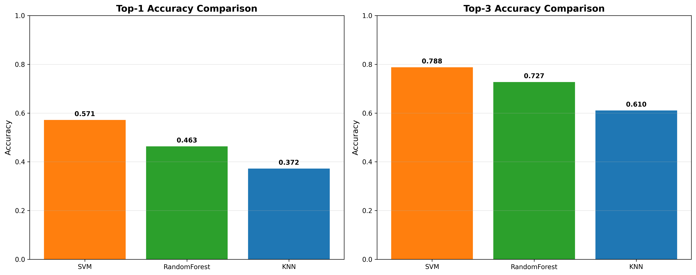
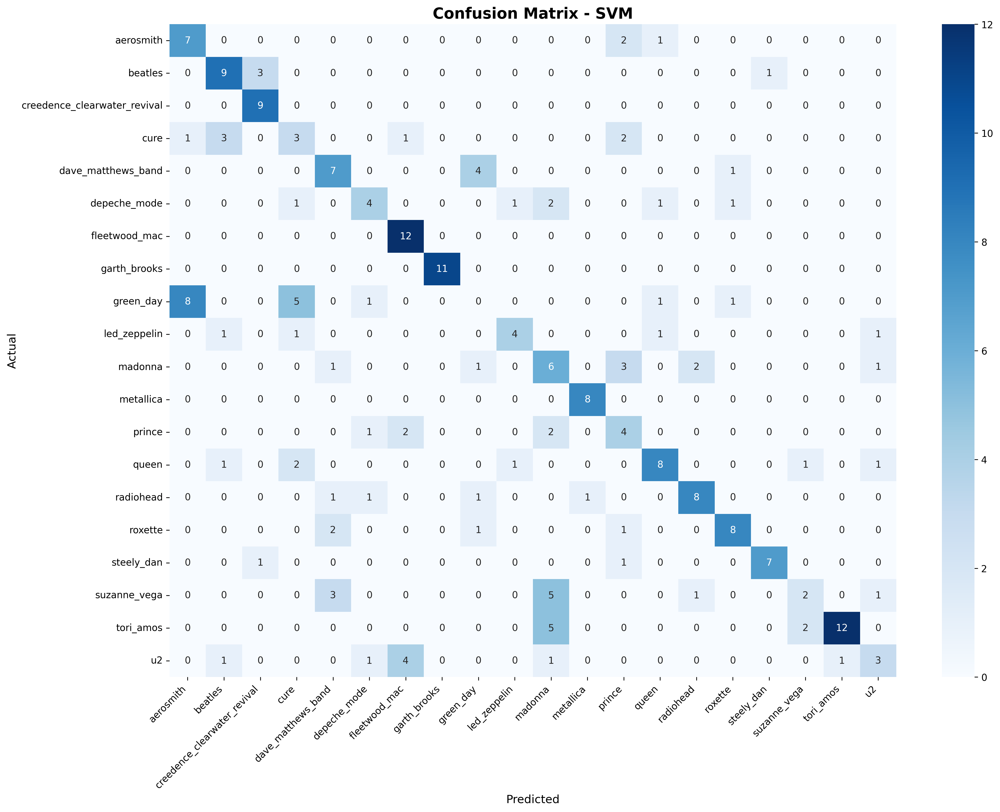
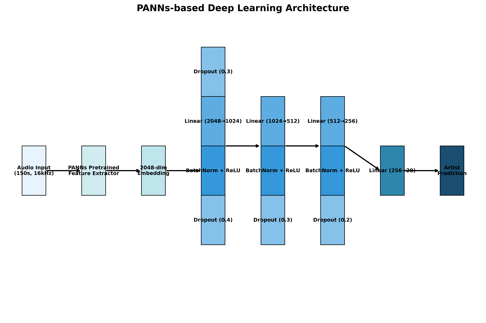
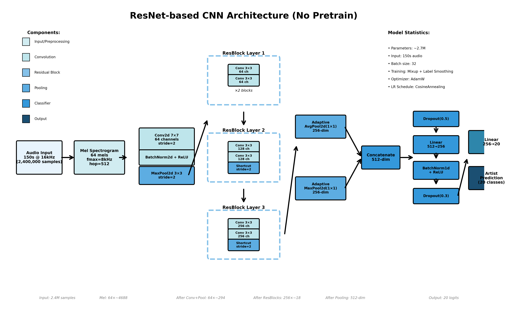
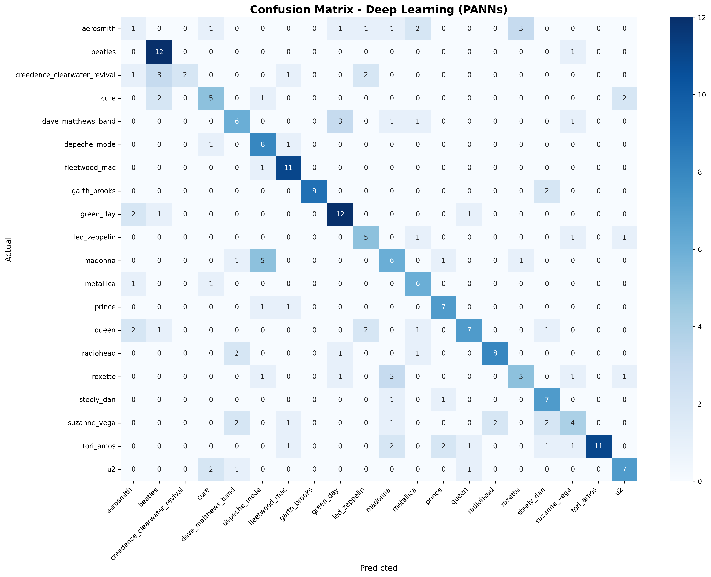
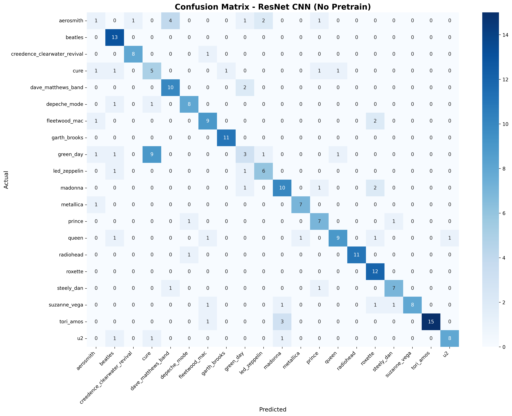
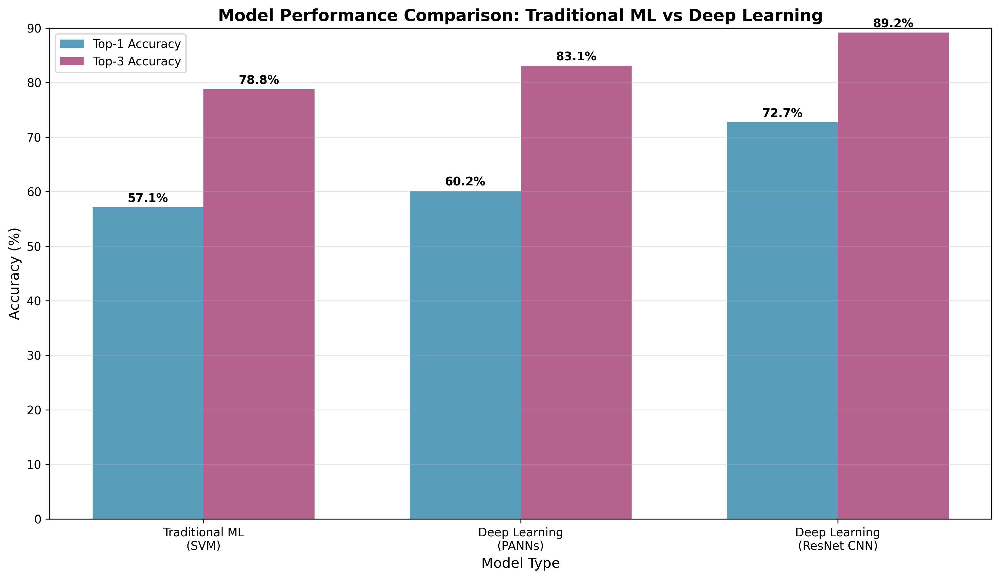
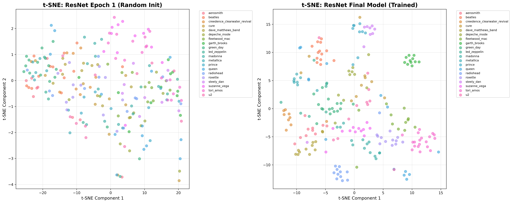

# NTU MIR 2025 - Homework 1

**Student:** 邱冠銘
**Student ID:** R14921046

---

# Task 1: Traditional Machine Learning for Artist Recognition

---

## Audio Features Extracted

### Core Features

- **MFCC Features:** 20 coefficients + Delta (velocity) + Delta-Delta (acceleration)
- **Mel Spectrogram:** 128 mel frequency bins with statistical aggregation
- **Spectral Features:** Centroid, Bandwidth (frequency-weighted), Rolloff (mel energy sum)

### Additional Features

- **Energy Features:** RMS Energy with temporal statistics
- **Rhythm Features:** Zero Crossing Rate, Tempo (from onset strength detection)
- **Advanced Features:**
  - Chroma-like features (first 12 mel bins)
  - Spectral Contrast (6 frequency bands, peak-to-valley ratios)

---

## Preprocessing Pipeline

### Data Processing Steps

- **RobustScaler** for outlier resistance
- **Feature Selection** (SelectKBest, top 100 features)
- **Statistical Aggregation** (mean, std, max, min over time)

### Feature Engineering

- **400+ dimensional features** → reduced to 100 via feature selection
- **GPU-accelerated extraction** with PyTorch for efficiency
- **Robust preprocessing** to handle NaN/inf values

---

## Traditional ML Models

### Models Implemented

- **SVM:** Multiple kernels (RBF, Linear, Polynomial) with grid search (C, γ, degree hyperparameters)
- **Random Forest:** Grid search over 100-300 trees with hyperparameter tuning
- **k-NN:** Grid search over k=3-15 with distance weighting

### Training Process

- **5-fold cross-validation** for hyperparameter tuning
- **Grid search** for optimal hyperparameters
- **Stratified validation** to ensure balanced evaluation

---

## Model Comparison

| Model | Top-1 Accuracy | Top-3 Accuracy |
|-------|----------------|----------------|
| **SVM** | **57.14%** | **78.79%** |
| Random Forest | 46.32% | 72.73% |
| k-NN | 37.23% | 61.04% |

---

## Confusion Matrix - SVM

- Strong diagonal indicates good overall classification
- Some artists more easily distinguishable than others (e.g Fleet Wood Mac, Green Day)
- Confusion often occurs between similar music styles

---

## Key Findings - Task 1

- **Best Model:** SVM with 57.14% top-1 and 78.79% top-3 accuracy
- **Feature diversity** and **proper preprocessing** are crucial
- **SVM with RBF kernel** works well for high-dimensional audio features

---

# Task 2: Deep Learning for Artist Recognition

---

## Approach Overview

### 1. PANNs (Transfer Learning)

- Pretrained Audio Neural Networks
- 2048-dim embeddings
- Frozen feature extractor
- Fine-tuned classifier head

### 2. ResNet CNN (From Scratch)

- End-to-end learning
- Mel spectrogram input
- Residual blocks
- No pretrained weights

---

## Model 1 - PANNs

### Architecture

- **Feature Extractor:** Pretrained PANNs (frozen)
- **Embedding:** 2048-dim
- **Classifier:** 4-layer MLP
  - 2048→1024→512→256→20

### Training

- **Input:** 150s @ 16kHz
- **Batch:** 8, **Epochs:** 100
- **Augmentation:** Crop, noise, stretch
- **Optimizer:** Adam (lr=0.005)
- **Scheduler:** ReduceLROnPlateau

---

---

## Model 2 - ResNet

### Architecture

- **Input:** Mel spectrogram (64 mels)
- **Layers:** 7×7 conv → ResBlocks (64, 128, 256)
- **Pooling:** Dual (Avg+Max) → 512-dim
- **Classifier:** 512→256→20
- **Params:** ~2.7M

### Training

- **Input:** 150s @ 16kHz
- **Batch:** 32, **Epochs:** 100
- **Augmentation:** Crop, noise, **mixup**
- **Optimizer:** AdamW (lr=0.01)
- **Scheduler:** CosineAnnealing
- **Label Smoothing:** 0.1

---

---

## Model Comparison Table

| Model | Type | Top-1 | Top-3 | Advantage |
|-------|------|-------|-------|-----------|
| SVM | Traditional ML | 57.14% | 78.79% | Fast, interpretable |
| PANNs | Transfer Learning | 60.17% | 83.12% | Pretrained |
| **ResNet** | **End-to-end DL** | **72.73%** | **89.18%** | **Best** |

---

## Confusion Matrices

---

---

---

## Improvements Summary

### vs SVM (Baseline)

- PANNs: +3.03% / +4.33%
- **ResNet: +15.59% / +10.39%**

### ResNet vs PANNs

- Top-1: **+12.56%**
- Top-3: **+6.06%**
- Params: 2.7M vs 81M+

---

## Key Insights

**Deep Learning vs Traditional ML - The Performance Gap:**

- **Feature learning advantage**: Deep learning automatically discovers hierarchical audio patterns (spectral, temporal, timbral) while SVM relies on hand-crafted MFCC features
- **Representation power**: ResNet's 2.7M parameters capture complex artist signatures vs. SVM's linear decision boundaries with limited expressiveness
- **Data utilization**: Neural networks excel at extracting patterns from raw audio across 150s duration, while traditional ML struggles with high-dimensional feature spaces
- **Why ResNet > PANNs**: Task-specific end-to-end training learns artist-discriminative features directly, while transfer learning from AudioSet general audio events doesn't align well with music artist classification domain

---

# Quick Start

---

## Inference Steps

- Link: <https://drive.google.com/file/d/1zpGiya4O_AF6SqTxcd-alf4x9OWGaY9R/view>
- Steps:
  - `pip install -r requirements.txt` -> Install dependencies
  - `bash get_dataset.sh` -> Download dataset
  - `python task2_inference.py` -> Inference

---

## Implementation & Reproducibility

### Task 1: Traditional ML

- `task1_preprocessing.py` -> Extract features and preprocess data
- `task1_train.py` -> Train models and save results
- `task1_gen_report.py` -> Generate confusion matrix and comparison charts

### Task 2: PANNs Model

- `task2_train.py` -> PANNs-based classifier with 150s audio
- `task2_inference.py` -> Generate predictions for test set
- `task2_gen_report.py` -> Generates confusion matrix and charts

### Task 2: ResNet CNN 🏆

- `task2_train_wo_pretrain.py` -> ResNet CNN from scratch
- `task2_inference_wo_pretrain.py` -> Generate predictions
- `task2_gen_report_wo_pretrain.py` -> Generates visualizations

---

## References

- **PANNs**: Kong, Q., et al. (2020). PANNs: Large-Scale Pretrained Audio Neural Networks for Audio Pattern Recognition. *IEEE/ACM Transactions on Audio, Speech, and Language Processing*.
- **ResNet**: He, K., et al. (2016). Deep Residual Learning for Image Recognition. *CVPR*.
- **Mixup**: Zhang, H., et al. (2018). mixup: Beyond Empirical Risk Minimization. *ICLR*.
- **Librosa**: McFee, B., et al. (2015). librosa: Audio and Music Signal Analysis in Python. *Proceedings of the 14th Python in Science Conference*.
- **MFCCs**: Logan, B. (2000). Mel Frequency Cepstral Coefficients for Music Modeling. *International Symposium on Music Information Retrieval*.
- **Spectral Features**: Peeters, G. (2004). A Large Set of Audio Features for Sound Description. *CUIDADO Project*.

---

# Thank you for your time
