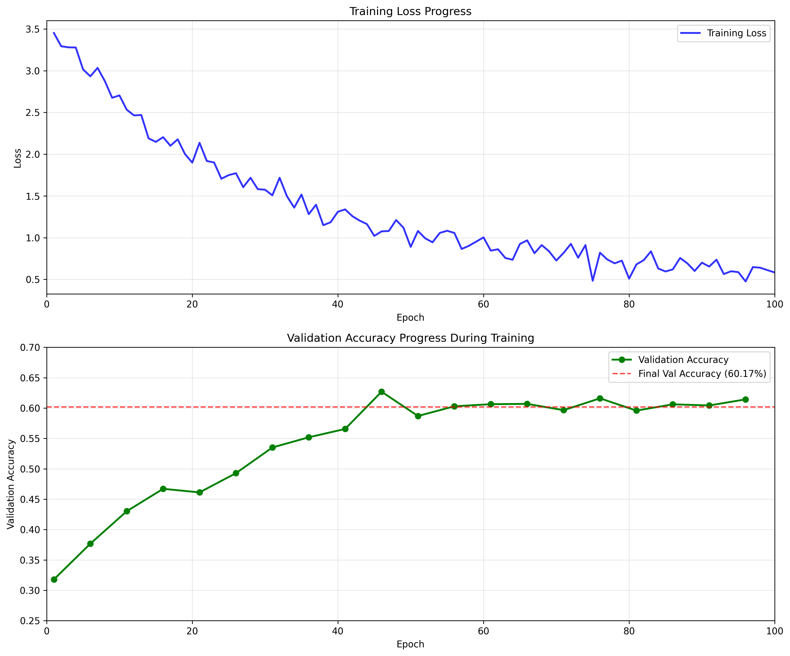
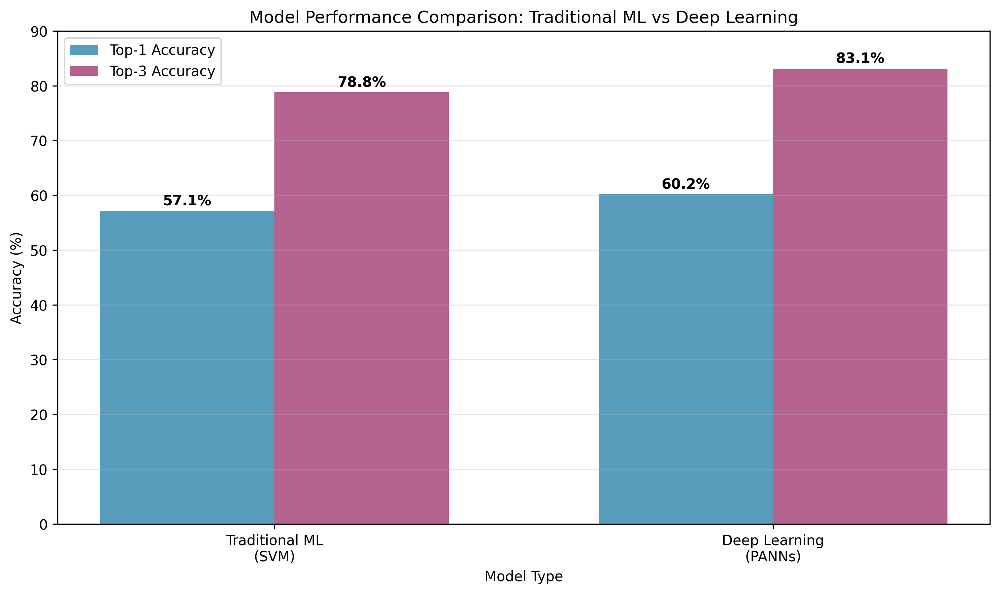

# NTU MIR 2025 - Homework 1

**Student:** 邱冠銘
**Student ID:** R14921046

---

# Task 1: Traditional Machine Learning for Artist Recognition

---

## Audio Features Extracted

### Core Features
- **MFCC Features:** 20 coefficients + Delta (velocity) + Delta-Delta (acceleration)
- **Mel Spectrogram:** 128 mel frequency bins with statistical aggregation
- **Spectral Features:** Centroid, Bandwidth (frequency-weighted), Rolloff (mel energy sum)

### Additional Features
- **Energy Features:** RMS Energy with temporal statistics
- **Rhythm Features:** Zero Crossing Rate, Tempo (from onset strength detection)
- **Advanced Features:**
  - Chroma-like features (first 12 mel bins)
  - Spectral Contrast (6 frequency bands, peak-to-valley ratios)

---

## Preprocessing Pipeline

### Data Processing Steps
- **RobustScaler** for outlier resistance
- **Feature Selection** (SelectKBest, top 100 features)
- **Statistical Aggregation** (mean, std, max, min over time)

### Feature Engineering
- **400+ dimensional features** → reduced to 100 via feature selection
- **GPU-accelerated extraction** with PyTorch for efficiency
- **Robust preprocessing** to handle NaN/inf values

---

## Traditional ML Models

### Models Implemented
- **SVM:** Multiple kernels (RBF, Linear, Polynomial) with grid search (C, γ, degree hyperparameters)
- **Random Forest:** Grid search over 100-300 trees with hyperparameter tuning
- **k-NN:** Grid search over k=3-15 with distance weighting

### Training Process
- **5-fold cross-validation** for hyperparameter tuning
- **Grid search** for optimal hyperparameters
- **Stratified validation** to ensure balanced evaluation

---

## Model Comparison

| Model | Top-1 Accuracy | Top-3 Accuracy |
|-------|----------------|----------------|
| **SVM** | **57.14%** | **78.79%** |
| Random Forest | 46.32% | 72.73% |
| k-NN | 37.23% | 61.04% |

---

## Confusion Matrix - SVM

- Strong diagonal indicates good overall classification
- Some artists more easily distinguishable than others (e.g Fleet Wood Mac, Green Day)
- Confusion often occurs between similar music styles

---

## Key Findings - Task 1
- **Best Model:** SVM with 57.14% top-1 and 78.79% top-3 accuracy
- **Feature diversity** and **proper preprocessing** are crucial
- **SVM with RBF kernel** works well for high-dimensional audio features

---

# Task 2: Deep Learning for Artist Recognition

---

## Deep Learning Architecture

### PANNs-based Model
- **Pretrained Features:** PANNs (Pretrained Audio Neural Networks) for feature extraction
- **Feature Dimension:** 2048-dimensional embeddings from pretrained model
- **Architecture:** Multi-layer classifier with batch normalization and dropout

### Model Components
- **Feature Extractor:** PANNs pretrained model (frozen)
- **Classifier Head:** 4-layer neural network (2048→1024→512→256→20)
- **Regularization:** Dropout layers (0.3, 0.4, 0.3, 0.2) and BatchNorm1d

---

---

## Training Configuration

### Model Settings
- **Audio Duration:** 150 seconds
- **Sample Rate:** 16kHz
- **Batch Size:** 8 samples
- **Epochs:** 100 maximum

### Training Strategy
- **Data Augmentation:** Random cropping, noise addition, time stretch
- **Optimizer:** Adam with weight decay (1e-4)
- **Learning Rate:** 0.005 with ReduceLROnPlateau scheduler
- **Early Stopping:** Based on test set performance

---

## Training Progress
- **Training Loss**: Steady decrease over 100 epochs
- **Validation Accuracy**: Converged to 60.17%
- **Learning Curve**: Shows proper convergence without overfitting

---

## Results

| Metric | Performance |
|--------|-------------|
| Val Top-1 Accuracy | 60.17% |
| Val Top-3 Accuracy | 83.12% |

- **Top-1:** +3.03% over SVM
- **Top-3:** +4.33% over SVM

---

## Confusion Matrix - Deep Learning

### Observations
- Similar performance to SVM in top-1 accuracy
- **Superior top-3 accuracy** (83.12% vs 78.79%)
- Strong performance on popular artists (Beatles, Fleetwood Mac)
- Better generalization with pretrained features

---

## Key Findings - Task 2
- **PANNs pretrained features** provide rich 2048-dimensional embeddings
- **Performance Improvements** over traditional ML:
  - Top-1 accuracy: +3.03% (57.14% → 60.17%)
  - Top-3 accuracy: +4.33% (78.79% → 83.12%)
- **Longer audio duration (150s)** captures more musical context
- **Deep learning** excels at learning complex audio-artist mappings

---

## Implementation & Reproducibility

### Task 1: Traditional ML
- `task1_preprocessing.py` -> Extract features and preprocess data
- `task1_train.py` -> Train models and save results
- `task1_gen_report.py` -> Generate confusion matrix and comparison charts

### Task 2: Deep Learning
- `task2_train.py` -> PANNs-based classifier with 150s audio
- `task2_inference.py` -> Generate predictions for test set
- `task2_gen_report.py` -> Generates confusion matrix and needed charts

--- 

## References

- **PANNs**: Kong, Q., et al. (2020). PANNs: Large-Scale Pretrained Audio Neural Networks for Audio Pattern Recognition. *IEEE/ACM Transactions on Audio, Speech, and Language Processing*.
- **Librosa**: McFee, B., et al. (2015). librosa: Audio and Music Signal Analysis in Python. *Proceedings of the 14th Python in Science Conference*.
- **MFCCs**: Logan, B. (2000). Mel Frequency Cepstral Coefficients for Music Modeling. *International Symposium on Music Information Retrieval*.
- **Spectral Features**: Peeters, G. (2004). A Large Set of Audio Features for Sound Description. *CUIDADO Project*.

---

# Thank you for your time!