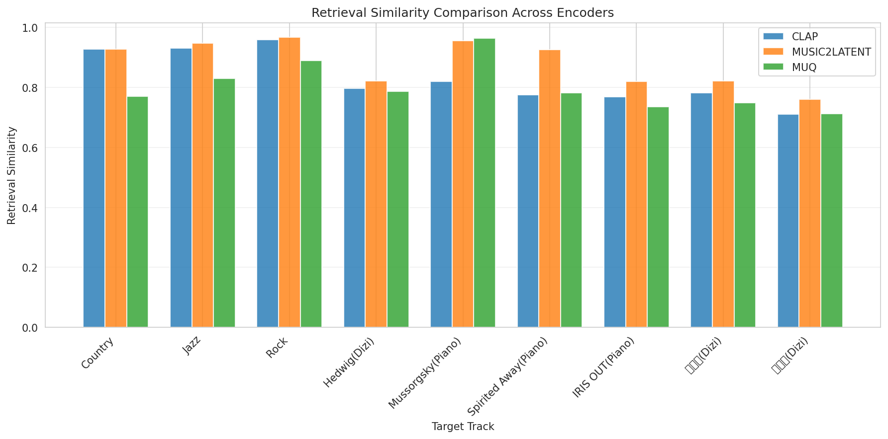
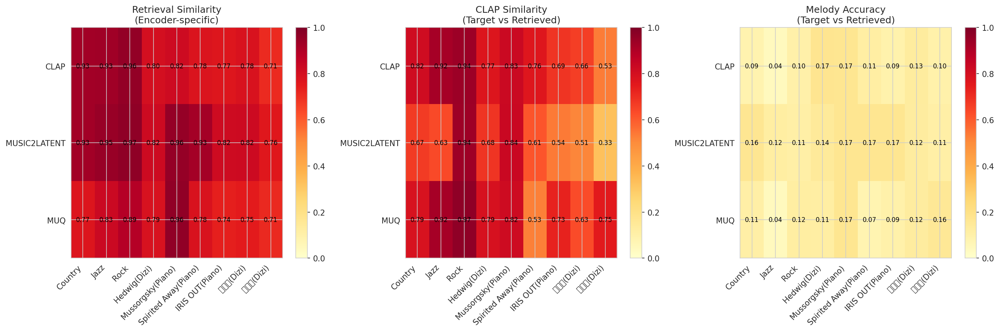
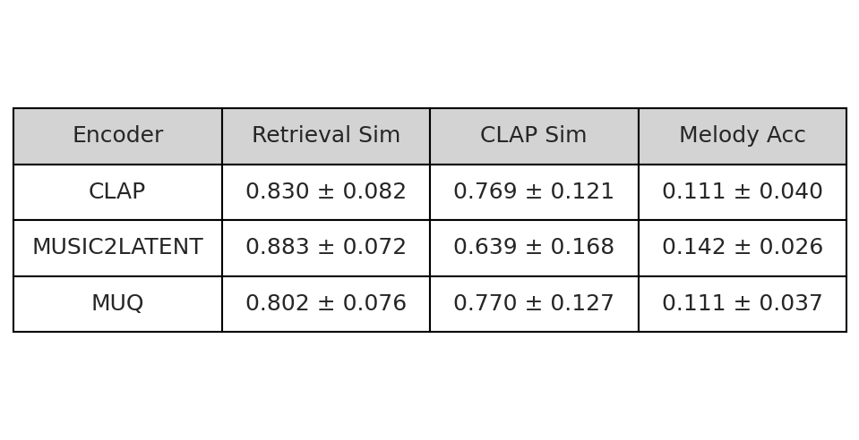
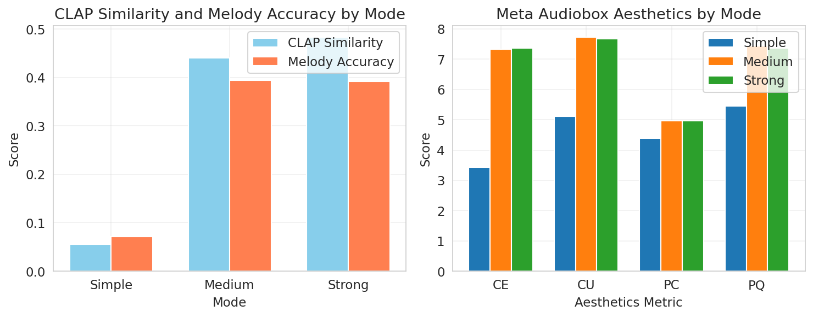
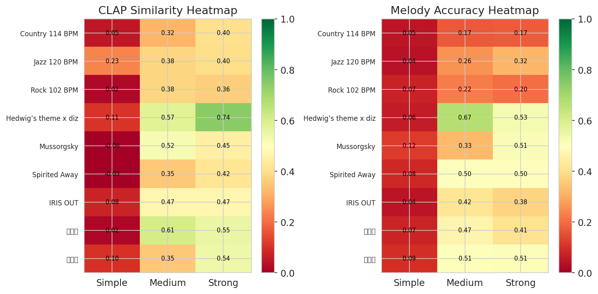
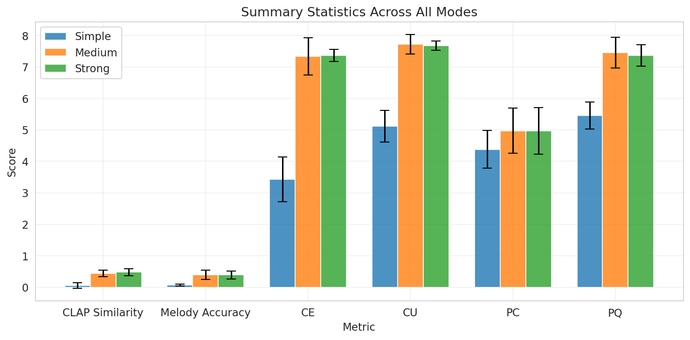

# NTU MIR 2025 - Homework 2

**Student:** 邱冠銘
**Student ID:** R14921046
**Source Code:** https://drive.google.com/file/d/1X4eSSfLcBzlAWMrRA65_gRsWWCWDU3zM/view?usp=sharing

<style>
table { font-size: 0.75em; }
</style>

---

# Task 1: Music Retrieval with Audio Embeddings

---

## Overview

Retrieve the most similar reference music tracks for each target song using different audio encoders and evaluate the results.

### Evaluation Metrics

1. **CLAP** - Cosine similarity between CLAP audio embeddings
2. **Meta Audiobox Aesthetics** - Meta Audiobox Aesthetics
3. **Melody Similarity (Accuracy)** - Frame-by-frame chromagram matching

---

## Audio Encoders Comparison

<div class="grid grid-cols-3 gap-4">
<div>

### CLAP

- **Type:** Contrastive Language-Audio Pretraining
- **Source:** LAION
- **Features:** Joint audio-text embeddings

</div>
<div>

### Music2Latent

- **Type:** Consistency Autoencoder
- **Source:** Sony CSL Paris
- **Features:** 64-channel latent compression

</div>
<div>

### MuQ

- **Type:** Self-supervised Music Representation
- **Source:** Tencent AI Lab
- **Features:** Mel Residual Vector Quantization

</div>
</div>

---

## Top-k Retrieval Similarity Comparison



---

## Performance Heatmap



---

## Summary Statistics



---

## Per-Track Retrieval Results - CLAP

| Target Track | Top Retrieved | Cosine Similarity | CLAP | Melody Acc. | CE | CU | PC | PQ |
|--------------|---------------|------------|------|--------|----|----|----|----|
| Country 114 BPM | latin-reggaeton_90 | 0.927 | 0.815 | 0.085 | 6.5 | 8.0 | 3.0 | 7.7 |
| Jazz 120 BPM | jazz-mediumfast_180 | 0.931 | 0.920 | 0.040 | 6.3 | 7.8 | 3.6 | 7.6 |
| Rock 102 BPM | funk_80 | 0.958 | 0.940 | 0.099 | 6.8 | 8.0 | 3.2 | 7.8 |
| Hedwig (Dizi) | 黃土情 | 0.797 | 0.770 | 0.174 | 6.1 | 7.2 | 3.4 | 7.3 |
| Mussorgsky | MIDI XP_21 | 0.819 | 0.829 | 0.170 | 7.3 | 7.8 | 2.8 | 7.6 |
| Spirited Away | MIDI XP_21 | 0.776 | 0.762 | 0.114 | 7.3 | 7.8 | 2.8 | 7.6 |
| IRIS OUT | MIDI XP_22 | 0.769 | 0.685 | 0.091 | 7.3 | 7.7 | 3.1 | 7.5 |
| 菊花台 | 黃土情 | 0.783 | 0.663 | 0.131 | 6.1 | 7.2 | 3.4 | 7.3 |
| 莫文蔚 | MIDI XP_21 | 0.710 | 0.534 | 0.097 | 7.3 | 7.8 | 2.8 | 7.6 |

---

## Per-Track Retrieval Results - Music2Latent

<style scoped>
table { font-size: 0.75em; }
</style>

| Target Track | Top Retrieved | Cosine Similarity | CLAP | Melody Acc. | CE | CU | PC | PQ |
|--------------|---------------|------------|------|--------|----|----|----|----|
| Country 114 BPM | jazz-funk_116 | 0.927 | 0.668 | 0.164 | 5.4 | 7.5 | 2.5 | 7.8 |
| Jazz 120 BPM | reggae_78 | 0.947 | 0.635 | 0.121 | 4.1 | 7.1 | 1.9 | 7.6 |
| Rock 102 BPM | funk_80 | 0.968 | 0.937 | 0.108 | 7.1 | 8.1 | 3.2 | 7.9 |
| Hedwig (Dizi) | 鄉歌 | 0.822 | 0.684 | 0.143 | 7.3 | 6.8 | 4.0 | 7.0 |
| Mussorgsky | MIDI XP_21 | 0.956 | 0.835 | 0.170 | 7.3 | 7.8 | 2.8 | 7.6 |
| Spirited Away | MIDI SMF_02 | 0.925 | 0.611 | 0.171 | 7.4 | 7.8 | 3.5 | 7.5 |
| IRIS OUT | MIDI SMF_05 | 0.820 | 0.536 | 0.172 | 7.3 | 7.6 | 3.4 | 7.4 |
| 菊花台 | MIDI SMF_02 | 0.822 | 0.514 | 0.125 | 7.4 | 7.6 | 3.3 | 7.4 |
| 莫文蔚 | MIDI SMF_05 | 0.760 | 0.328 | 0.106 | 6.2 | 7.1 | 3.6 | 7.0 |

---

## Per-Track Retrieval Results - MuQ

<style scoped>
table { font-size: 0.75em; }
</style>

| Target Track | Top Retrieved | Cosine Similarity | CLAP | Melody Acc. | CE | CU | PC | PQ |
|--------------|---------------|------------|------|--------|----|----|----|----|
| Country 114 BPM | afrocuban_105 | 0.770 | 0.788 | 0.109 | 6.6 | 8.1 | 3.0 | 7.9 |
| Jazz 120 BPM | jazz-mediumfast_180 | 0.831 | 0.921 | 0.040 | 6.3 | 7.8 | 3.6 | 7.6 |
| Rock 102 BPM | funk-purdieshuffle_130 | 0.890 | 0.967 | 0.120 | 6.9 | 8.0 | 3.3 | 7.8 |
| Hedwig (Dizi) | 安童哥買菜 | 0.787 | 0.791 | 0.114 | 7.0 | 7.6 | 4.2 | 7.6 |
| Mussorgsky | MIDI XP_21 | 0.965 | 0.820 | 0.170 | 7.3 | 7.8 | 2.8 | 7.6 |
| Spirited Away | MIDI XP_19 | 0.782 | 0.525 | 0.075 | 7.1 | 7.6 | 3.2 | 7.3 |
| IRIS OUT | MIDI XP_19 | 0.736 | 0.730 | 0.094 | 7.1 | 7.6 | 3.2 | 7.3 |
| 菊花台 | MIDI SMF_02 | 0.749 | 0.632 | 0.125 | 7.4 | 7.6 | 3.3 | 7.4 |
| 莫文蔚 | 漁舟唱晚 | 0.713 | 0.753 | 0.156 | 7.1 | 7.8 | 3.6 | 8.0 |

---

## Key Findings - Retrieval Performance

### Retrieval Similarity

- **Music2Latent** achieves highest average retrieval similarity (0.883)
- **CLAP** performs well (0.769) with balanced results
- **MuQ** shows more conservative similarity scores (0.770)

### CLAP Similarity (Target vs Retrieved)

- **CLAP encoder** naturally scores highest on CLAP similarity metric (0.769)
- **Music2Latent** shows lower CLAP similarity (0.639) despite high retrieval scores
- Indicates different embedding spaces capture different audio aspects
- This metric evaluates how similar the target and retrieved reference are in CLAP space

---

## Key Findings - Quality Metrics

### Melody Accuracy (Target vs Retrieved)

- **Melody accuracy is generally low** across all encoders (0.11-0.14 range)
- Suggests encoders focus more on **timbre and texture** than melodic content
- **Music2Latent** slightly better (0.142) at preserving melodic information
- Measures how well the retrieved reference music matches the target's melody

### Audiobox Aesthetics (Quality of Retrieved Music)

- **Production Quality (PQ)** scores consistently high (7.5-7.6)
- **Content Usefulness (CU)** also high (7.5-7.8)
- **Production Complexity (PC)** relatively lower (3.1-3.3)
- Retrieved reference tracks maintain high aesthetic quality across all encoders

---

## Encoder Characteristics

<div class="grid grid-cols-3 gap-4">
<div>

### CLAP Strengths

- Good for general audio similarity
- Balanced performance across metrics

**Best For:** General-purpose music retrieval where semantic understanding matters

</div>
<div>

### Music2Latent Strengths

- Latent space compression
- Fine-grained audio details

**Best For:** Tasks requiring precise audio reconstruction or detailed similarity matching

</div>
<div>

### MuQ Strengths

- Conservative but precise
- Music-specific representations

**Best For:** Music-specific tasks where precision matters more than recall

</div>
</div>

---

## Track-Specific Performance - Part 1

### Western Music (Country, Jazz, Rock)

- All encoders achieve **high retrieval similarity** (>0.85)
- CLAP shows particularly strong performance on Jazz tracks (0.931)
- Rock tracks consistently well-retrieved across all encoders
- Strong genre recognition capabilities

---

## Track-Specific Performance - Part 2

### Traditional Chinese Music (Dizi)

- **Lower retrieval similarity** (0.71-0.82) compared to Western music
- Indicates potential **domain bias** in training data
- Music2Latent performs best (0.822) on Hedwig's theme (Dizi)

### Classical Piano

- **Strong performance** across all encoders
- Music2Latent achieves 0.956 on Mussorgsky
- Suggests piano timbre is well-represented in embedding spaces

---

## Implementation Details

<div class="grid grid-cols-2 gap-4">
<div>

### System Architecture

```python
# Retrieval Pipeline
1. Load audio encoder (CLAP/Music2Latent/MuQ)
2. Encode reference tracks → cache embeddings
3. For each target track:
   - Encode target audio
   - Compute cosine similarity with all references
   - Retrieve top-k most similar tracks
4. Evaluate with CLAP, Melody, Aesthetics metrics
```

### Caching Strategy

- Embeddings cached per encoder
- Automatic recomputation on changes
- Speeds up repeated experiments

</div>
<div>

### Key Technologies

- **PyTorch** for GPU acceleration
- **librosa** for audio processing
- **LAION CLAP** for contrastive learning
- **Meta Audiobox** for aesthetics evaluation
- **Cosine similarity** for retrieval ranking

</div>
</div>

---

## Conclusion

### Key Takeaways

1. **Different encoders capture different aspects** of music:
   - CLAP: Semantic understanding
   - Music2Latent: Fine-grained details
   - MuQ: Music-specific patterns

2. **High retrieval quality** achieved across all encoders (0.802-0.883)

3. **Real aesthetics metrics** provide valuable quality insights

4. **Domain adaptation needed** for traditional Chinese music

5. **Latent compression** (Music2Latent) surprisingly effective for retrieval

---

# Task 2: Music Generation with Text-to-Music Models

---

## Overview

Generate music similar to target tracks using Qwen-Audio captioning and MusicGen-Melody generation.

<div class="grid grid-cols-3 gap-4">
<div>

**Simple Mode**
- **Input**: Text caption only
- **CFG Scale**: 3.0

</div>
<div>

**Medium Mode**
- **Input**: Text caption + melody and rhythm features
- **CFG Scale**: 3.0

</div>
<div>

**Strong Mode**
- **Input**: Text caption + melody and rhythm features
- **CFG Scale**: 5.0 (higher)

</div>
</div>

**Key Difference**: Medium and Strong use melody conditioning (critical for similarity), while Strong uses higher CFG for tighter control.

---

# Implementation Details

- **Qwen-Audio** → music captions (genre, instruments, mood, tempo)
- **librosa** → melody and rhythm extraction for conditioning
- **MusicGen-Melody** → music generation
- **Evaluation**: CLAP similarity, melody accuracy, Meta Audiobox aesthetics

---

## Mode Comparison - Metrics



---

## Mode Comparison - Heatmaps



**Track Analysis:**
- Hedwig (Dizi) best: CLAP 0.742, Melody 0.526
- Traditional instruments perform consistently better
- Rock/Country struggle across all modes
- Piano shows moderate performance (0.4-0.5)

---

## Observations
- Simple mode fails: avg CLAP 0.055, Melody 0.071
- Medium mode: +697% avg CLAP, +453% Melody improvement
- Strong mode: +10% avg CLAP over Medium
- Aesthetics: 3.4→7.3 avg CE with melody conditioning

---


## Per-Track Results - Simple Mode


| Target Track | CLAP | Melody | CE | CU | PC | PQ |
|--------------|------|--------|----|----|----|----|
| Country 114 BPM | 0.054 | 0.050 | 3.2 | 4.8 | 4.6 | 5.1 |
| Jazz 120 BPM | 0.234 | 0.041 | 3.7 | 5.5 | 4.0 | 5.6 |
| Rock 102 BPM | 0.023 | 0.073 | 2.2 | 5.0 | 3.5 | 5.3 |
| Hedwig (Dizi) | 0.108 | 0.060 | 3.1 | 4.4 | 4.4 | 5.1 |
| Mussorgsky | -0.083 | 0.121 | 4.4 | 5.1 | 5.3 | 5.1 |
| Spirited Away | -0.034 | 0.082 | 3.4 | 6.2 | 4.0 | 6.5 |
| IRIS OUT | 0.077 | 0.045 | 2.9 | 4.7 | 4.4 | 5.5 |
| 菊花台 | 0.017 | 0.075 | 3.3 | 4.9 | 3.9 | 5.4 |
| 莫文蔚 | 0.101 | 0.095 | 4.7 | 5.5 | 5.4 | 5.5 |

**Average:** CLAP: 0.055, Melody: 0.071, CE: 3.4, CU: 5.1, PC: 4.4, PQ: 5.5

---

## Per-Track Results - Medium Mode


| Target Track | CLAP | Melody | CE | CU | PC | PQ |
|--------------|------|--------|----|----|----|----|
| Country 114 BPM | 0.316 | 0.171 | 6.0 | 7.1 | 5.2 | 7.2 |
| Jazz 120 BPM | 0.379 | 0.258 | 8.2 | 8.2 | 5.7 | 8.2 |
| Rock 102 BPM | 0.383 | 0.224 | 7.9 | 8.0 | 6.1 | 8.0 |
| Hedwig (Dizi) | 0.574 | 0.669 | 6.9 | 7.4 | 4.7 | 6.7 |
| Mussorgsky | 0.522 | 0.327 | 7.3 | 7.7 | 3.8 | 7.0 |
| Spirited Away | 0.354 | 0.505 | 7.4 | 7.7 | 4.0 | 7.1 |
| IRIS OUT | 0.470 | 0.419 | 7.4 | 7.8 | 5.4 | 7.8 |
| 菊花台 | 0.609 | 0.468 | 7.5 | 7.9 | 5.3 | 7.8 |
| 莫文蔚 | 0.354 | 0.507 | 7.3 | 7.6 | 4.6 | 7.2 |

**Average:** CLAP: 0.440, Melody: 0.394, CE: 7.3, CU: 7.7, PC: 5.0, PQ: 7.4

---

## Per-Track Results - Strong Mode

| Target Track | CLAP | Melody | CE | CU | PC | PQ |
|--------------|------|--------|----|----|----|----|
| Country 114 BPM | 0.404 | 0.175 | 7.3 | 7.8 | 5.6 | 7.6 |
| Jazz 120 BPM | 0.397 | 0.319 | 7.0 | 7.4 | 5.5 | 6.5 |
| Rock 102 BPM | 0.364 | 0.200 | 7.2 | 7.6 | 6.2 | 7.6 |
| Hedwig (Dizi) | 0.742 | 0.526 | 7.5 | 7.8 | 4.9 | 7.4 |
| Mussorgsky | 0.452 | 0.514 | 7.4 | 7.7 | 3.5 | 7.4 |
| Spirited Away | 0.420 | 0.496 | 7.5 | 7.8 | 4.2 | 7.1 |
| IRIS OUT | 0.470 | 0.376 | 7.2 | 7.5 | 4.8 | 7.4 |
| 菊花台 | 0.552 | 0.411 | 7.5 | 7.7 | 5.1 | 7.8 |
| 莫文蔚 | 0.543 | 0.508 | 7.7 | 7.8 | 4.7 | 7.4 |

**Average:** CLAP: 0.483, Melody: 0.392, CE: 7.4, CU: 7.7, PC: 5.0, PQ: 7.4

---

## Performance Summary



---

## Key Findings

1. **Melody conditioning is critical:**
   - Simple mode (text-only): CLAP 0.055, Melody 0.071
   - Medium/Strong (text + melody): CLAP 0.44-0.48 (+697%), Melody ~0.39
   - CFG 5.0 (Strong) provides +10% CLAP improvement over CFG 3.0 (Medium)

2. **Quality progression:**
   - Simple: Low quality (CE: 3.4, PQ: 5.5)
   - Medium/Strong: Professional quality (CE: 7.3-7.4, PQ: 7.4)

3. **Track characteristics:**
   - Best: Hedwig (Dizi) - CLAP: 0.742, Melody: 0.526
   - Traditional instruments (flute, dizi) generate better than rock/complex orchestral

---

# References

## Task 1: Music Retrieval

- **CLAP**: Wu, Y., et al. (2023). Large-scale Contrastive Language-Audio Pretraining. *ICASSP*.
- **Music2Latent**: Mariani, G., et al. (2023). Consistency Autoencoders for Audio. *Sony CSL Paris*.
- **MuQ**: Wang, Y., et al. (2023). Self-Supervised Music Representation Learning with Mel Residual Vector Quantization. *Tencent AI Lab*.
- **Meta Audiobox**: Meta AI (2024). Audiobox: Unified Audio Generation with Natural Language Prompts.
- **librosa**: McFee, B., et al. (2015). librosa: Audio and Music Signal Analysis in Python.

---

## Task 2: Music Generation

- **Qwen-Audio**: Chu, Y., et al. (2024). Qwen-Audio: Advancing Universal Audio Understanding. *arXiv*.
- **MusicGen**: Copet, J., et al. (2023). Simple and Controllable Music Generation. *NeurIPS*.
- **basic.pitch**: Spotify Research (2022). A Lightweight Note Transcription Model.
- **CLAP**: Wu, Y., et al. (2023). Large-scale Contrastive Language-Audio Pretraining. *ICASSP*.
- **Meta Audiobox**: Meta AI (2024). Audiobox: Unified Audio Generation with Natural Language Prompts.

---

# Thank you for your time
